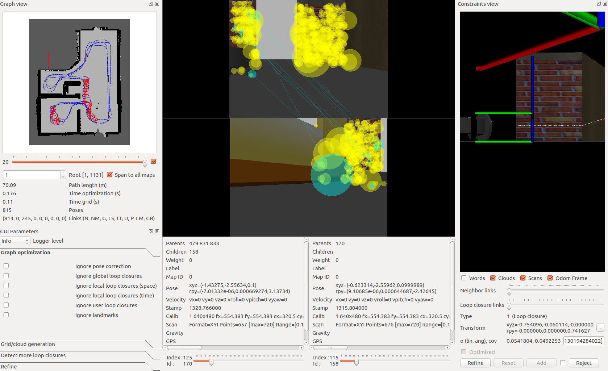
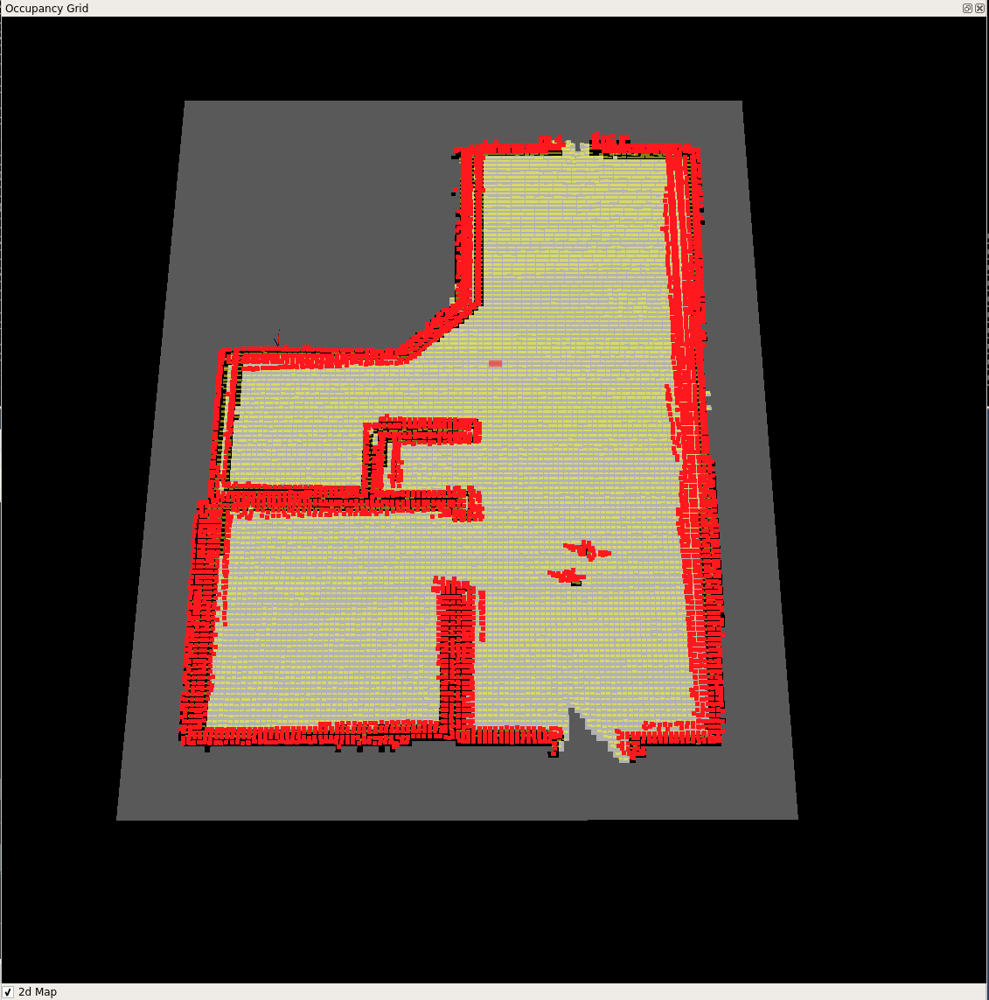
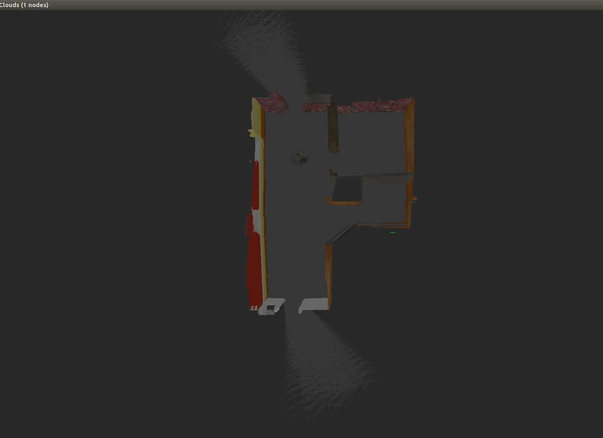

# Map-My-World Project








### Install Requirements
This project requires `gcc>=9` due to the use of `C++17`.
```sh
$ git clone https://github.com/daniel-m-campos/map-my-world.git --recurse-submodules
$ cd map-my-world
$ source install-ubuntu.sh
```

### Build the workspace
```sh
$ cd <path-to-repo-workspace>/map-my-world/src
$ cd src
$ catkin_init_workspace
$ cd ..
$ catkin_make
```

### Launching
#### Gazebo World
```sh
$ cd <path-to-repo-workspace>/map-my-world
$ source devel/setup.sh
$ roslaunch my_robot world.launch
```
#### Teleop
Open a new terminal:
```sh
$ cd <path-to-repo-workspace>/map-my-world
$ source devel/setup.sh
$ roslaunch my_robot teleop.launch
```
#### Rtabmap
Open a new terminal:
```sh
$ cd <path-to-repo-workspace>/map-my-world
$ source devel/setup.sh
$ roslaunch my_robot mapping.launch
```

### Source Structure
```sh
map-my-world
├── config.rviz
├── download_data.sh
├── img
│   └── graph_view.png
├── install-ubuntu.sh
├── README.md
└── src
    ├── CMakeLists.txt -> /opt/ros/melodic/share/catkin/cmake/toplevel.cmake
    ├── my_robot
    ├── rtabmap_ros
    └── teleop_twist_keyboard

5 directories, 6 files

```